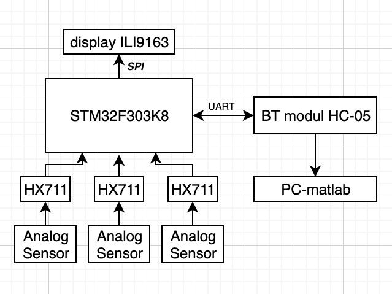
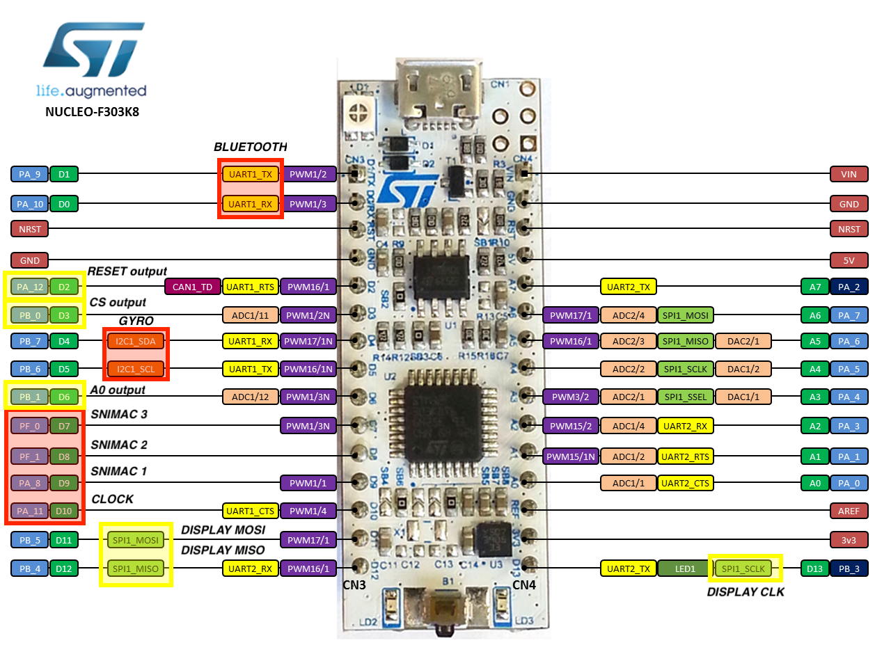
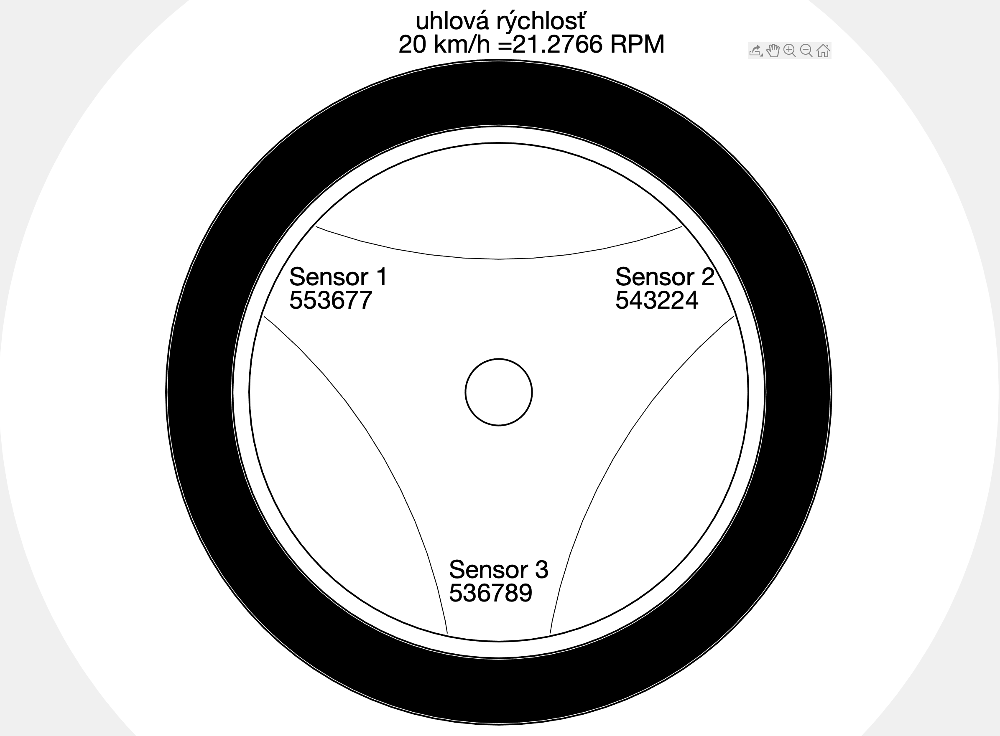
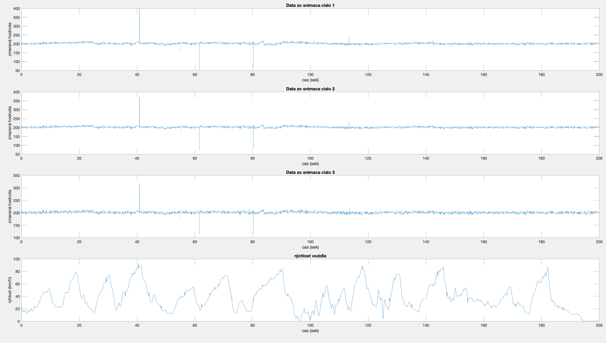

# Meranie a spracovanie dát z analógových snímačov
Cieľom projektu je vytvoriť zariadenie, ktoré meria presné dáta z analógových snímačov, konkrétne tenzometrov. Dáta sú spracované A/D prevodníkom, ktorý ďalej posiela dáta do mcu pomocou hodinového signálu. Dáta sa taktiež zobrazujú na displeji, ktorý komunikuje s mcu prostredníctvom SPI periférie. Dáta sa taktiež odosielajú prostredníctvom bluetooth modulu, pomocou UART protokolu do mobilného zariadenia v ktorom je realizovaná vizualizácia meraného objektu (v našom prípade koleso auta) pomocou matlabu. Vizualizované je samotné koleso, na ktorom sú zobrazené tenzometre, blízko ktorých sa budú zobrazujú namerané
hodnoty. Zobrazuje sa taktiež rýchlosť otáčania kolesa.
## Bloková schéma

## Schéma zapojenia jednotlivých periférí k mcu

## Komponenty
* Tenzometer BF350
* Prevodník HX711
* BT - HC-05 
* Vzorka na meranie (koleso)
* Displej ILI9163
* Mobilné zariadenie (PC s matlabom)
## Popis
Po pripojení a spustení zariadenia sa spustí časť programu, ktorá čaká na príkaz z BT modulu pre spustenie merania. Samotné zariadenie je schopné meriať z troch analógových senzorov, z ktorých vyčítané dáta sú automaticky zobrazované na displej a následne sú prostredníctvom BT modulu odosielané priamo do matlabu, kde prebieha vizualizácia projektu.
## Vizualizácia

## Návod na použitie
Osobný počítač je potrebné pripojiť prostredníctvom bluetooth periférie k zariadeniu. Po pripojení je potrebné otvoriť súbor untitled.m, ktorého úlohou je zistiť, či sa zariadenie pripojilo správne. Následne treba otvoriť súbor zadanie.m , ktorého úloha je samotné príjmanie dát a vizualizácia. V súbore untitled1.m je možné vykreslenia priebehov ukážkového merania

## Programová dokumentácia
Po inicializácii všetkých periférií sa program nachádza v nekonečnej slučke do momentu kým, nedostane zariadenie príkaz z matlabu pre spustenie merania. Ak tak nastane začne sa postupné meranie z každného senzora. Nasleduje vykreslovanie zmeraných hodnôt na displej. Tieto dáta sú taktiež odosielané do osobného počítača, kde nastáva spracovanie údajov, prevod do ing. jednotiek a následne sa spúšťa vizualizácia kde prebieha real time vypisovanie údajov.
## Záver
Počas realizácie meranie je potrebné si potrobne naštudovať prácu so snímačmi (ich aplikácia na povrch a následné spracovávanie údajov v simulačných softwaroch). Údajé z uhlovej rýchlosti kolesa sme získali z presného indukčného snímača Omron K3HB-R. Alternativou tohoto snímača je 3D gyroskop LSM6DS0, na doske IKS01A1, ktorého aplikácia a meranie samotných hodnôt je však náročné a nepresné.
